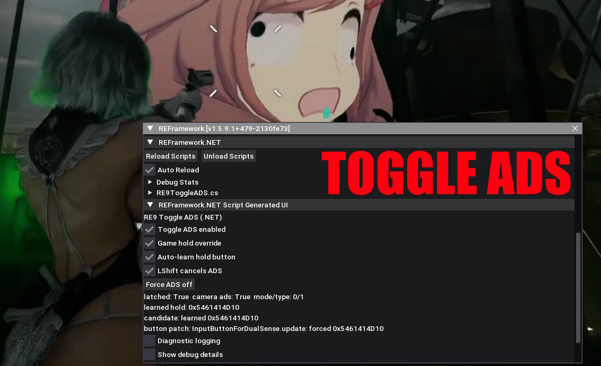

# RE9 Toggle ADS

REFramework.NET mod to **toggle** ADS on RMB instead of **holding RMB down all the time like a retard that Capcom thinks you are**

## Features

* Toggle ~~AIDS~~ ADS on RMB
* Exit toggled ADS on LShift
* It might work

## Installation

1. Install all [prerequisites](https://cursey.github.io/reframework-book/api_cs/general/index.html#prerequisites) for a REFramework build with REFramework.NET support. If installed right, you'll likely observe a cmd generating a ton of .NET assemblies when starting the game.
2. For [Fluffy Mod Manager](https://www.nexusmods.com/site/mods/818): download [.zip](https://github.com/comdev1337/RE9-Toggle-ADS/releases), put in `ModManager/Games/RE9/Mods`. Otherwise just put [RE9ToggleADS.cs](reframework/plugins/source/RE9ToggleADS.cs) in `reframework\plugins\source`

## Notes

- The script learns the internal ADS hold button automatically per session.
- Loading a different save may rebuild the underlying input objects; the script detects this and relearns automatically.
- Tested with REFramework `v1.5.9.1+479-2130fe73`, game version `1.3.0.0`.
